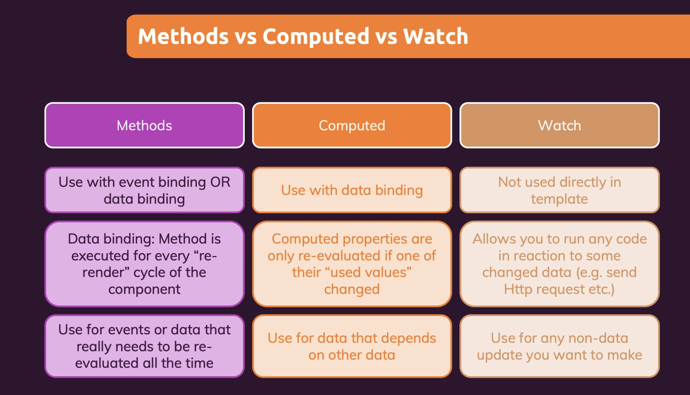

# Vue development tools (Part 3)

### `Key Word: Two data binding / v-model / computed / watcher.`

- #### Click here: [BACK TO NAVIGASTION](https://github.com/DonghaoWu/WebDev-tools-demo/blob/master/README.md)

## `Section: Front-end`(Vue Basics)

### `Summary`: In this documentation, we learn Vue.js computed / watcher features.

### `Check Dependencies & Tools:`

- null

#### `本章背景：`

- 本章主要介绍如何用最简单的方式实现 vue + event

- \*\*\*要点

  - two way data binding
  - computed property
  - watch property

  - 什么是 two way data binding?

    - 需要说明的是，不实现 two way data binding 的话，input 里面的内容也是可以实时捕捉的。
    - 在 input tag 中，里面有一个 value attribute，它是的作用是引用外部变量去控制 input 里面的内容。
    - two way data binding 的意思是，输入的 data 不是马上实时捕捉并显示在栏内，而是进入到 js 的 function 里面，通过赋值相关的 state 变量(react) 或者 data 变量(vue) 之后，最后通过 value attribute 重新穿回 input 栏的过程。
    - 简单来说，就是捕捉 e.target.value 的值进行加工之后，把结果赋值回 value (也就是 e.target.value) 中。
    - 这样做的好处是可以存储和方便改变/清空输入栏，可以实现对输入栏的监测和控制。
    - `大多数的输入 input 都是应用这种方式处理的。`

  - 为什么要使用 computed property？

    - 在 Vue 的设定里面，data 是一个 object，当这个 object 里面的其中一个值改变的时候，都会引起其他引用这个 object 数据的 method 重新运算一遍
    - 或者这样说，Vue 的设定是只要 data 出现变化，整个页面都会实现 rerender，这时所有有关 data 的 method 都会重新运算一遍
    - 上面两个说法偏向第一个。
    - 而 computed 里面的函数只有当它里面包含的指定的 data 部分出现变化才会重新运算。
    - 所以最大区别是，`method 是全部重运算，computed 是指定数据改变的时候才重运算。`
    - 这里也可看出，method 是不适合使用在对 data 进行运算后输出的地方。

  - watch 的 function 名字必须跟 data 里面的 property 一样，且只能监测一个变量。但 computed 可以检测多个变量。

  - 关于 methods / computed / watch 的应用

  <p align="center">
  
  </p>

### <span id="1.0">`Brief Contents & codes position`</span>

- #### Click here: [BACK TO NAVIGASTION](https://github.com/DonghaoWu/WebDev-tools-demo/blob/master/README.md)

- [1.1 Two way data binding & v-model.](#1.1)
- [1.2 Computed property.](#1.2)
- [1.3 Watcher.](#1.3)
- [1.4 shorthand.](#1.4)

---

### <span id="1.1">`Step1: Two way data binding & v-model.`</span>

- #### Click here: [BACK TO CONTENT](#1.0)

  1. 关键代码

  ```diff
  - <input type="text" v-bind:value="name" v-on:input="setname" />
  + <input type="text" v-model=“name” />
  ```

  2. 两种方式比较

  **`Location: ./index.html`**

  ```html
  <!DOCTYPE html>
  <html lang="en">
    <head>
      <meta charset="UTF-8" />
      <meta name="viewport" content="width=device-width, initial-scale=1.0" />
      <title>Vue Basics</title>
      <link
        href="https://fonts.googleapis.com/css2?family=Jost:wght@400;700&display=swap"
        rel="stylesheet"
      />
      <link rel="stylesheet" href="styles.css" />
      <script src="https://unpkg.com/vue@next" defer></script>
      <script src="app.js" defer></script>
    </head>
    <body>
      <header>
        <h1>Vue two way data binding Events</h1>
      </header>
      <section id="events">
        <!-- modify the data immediately -->
        <label>TWB 1: </label>
        <input type="text" v-bind:value="name1" v-on:input="setName" />
        <br />
        <button v-on:click="resetName1">Click here to reset name1</button>
        <p>Your Name: {{name1}}</p>

        <label>TWB 2: </label>
        <input type="text" v-model="name2" />
        <br />
        <button v-on:click="resetName2">Click here to reset name2</button>
        <p>Your Name: {{name2}}</p>
      </section>
    </body>
  </html>
  ```

  ```js
  const app = Vue.createApp({
    data() {
      return {
        name1: '',
        name2: '',
      };
    },
    methods: {
      setName(event) {
        this.name1 = event.target.value;
      },
      resetName1() {
        this.name1 = '';
      },
      resetName2() {
        this.name2 = '';
      },
    },
  });

  app.mount('#events');
  ```

#### `Comment:`

1. 可以看出 v-model 快捷方式比传统方式节省了

```diff
- v-bind:value="name1"
- v-on:input="setName"
- methods setName
```

### <span id="1.2">`Step2: Computed property.`</span>

- #### Click here: [BACK TO CONTENT](#1.0)

1. 关键代码

```diff
+ <p>Your name {{ fullname }}</p>

const app = Vue.createApp({
  data() {
    return {
      name: '',
      lastName: '',
    };
  },
  computed: {
    fullname() {
      return this.name + ' ' + this.lastName;
    },
  },
});
```

2. 例子

**`Location: ./index.html`**

```html
<!DOCTYPE html>
<html lang="en">
  <head>
    <meta charset="UTF-8" />
    <meta name="viewport" content="width=device-width, initial-scale=1.0" />
    <title>Vue Basics</title>
    <link
      href="https://fonts.googleapis.com/css2?family=Jost:wght@400;700&display=swap"
      rel="stylesheet"
    />
    <link rel="stylesheet" href="styles.css" />
    <script src="https://unpkg.com/vue@next" defer></script>
    <script src="app.js" defer></script>
  </head>
  <body>
    <header>
      <h1>Vue two way data binding Events</h1>
    </header>
    <section id="events">
      <label>Computed property </label>

      <label>Name: </label>
      <input type="text" v-model="name" />

      <label>Last name: </label>
      <input type="text" v-model="lastName" />

      <p>Your fullname {{ fullname }}</p>
    </section>
  </body>
</html>
```

```js
const app = Vue.createApp({
  data() {
    return {
      name: '',
      lastName: '',
    };
  },
  computed: {
    fullname() {
      return this.name + ' ' + this.lastName;
    },
  },
});

app.mount('#events');
```

#### `Comment:`

1. `method 在 {{}} 中是要一定使用括号的，但是 computed 是一定不需要的。`
2. computed 主要是提高效率和防止 method 的重复运算。

### <span id="1.3">`Step3: Watcher.`</span>

- #### Click here: [BACK TO CONTENT](#1.0)

  1. 关键代码，关于 computed 跟 watch 的区别

  ```js
  data(){
    return{
      counter:0,
      name:'',
      lastName:'',
      fullname:''
    }
  },
  watch:{
    name(value){
      this.fullname = value + ' ' + this.lastName
    },
    lastName(value){
      this.fullname = this.name + ' ' + value
    }
  },
  computed:{
    fullname(){
      return this.name + ' ' + this.lastName
    }
  }
  ```

  2. 例子

  **`Location: ./index.html`**

  ```html
  <!DOCTYPE html>
  <html lang="en">
    <head>
      <meta charset="UTF-8" />
      <meta name="viewport" content="width=device-width, initial-scale=1.0" />
      <title>Vue Basics</title>
      <link
        href="https://fonts.googleapis.com/css2?family=Jost:wght@400;700&display=swap"
        rel="stylesheet"
      />
      <link rel="stylesheet" href="styles.css" />
      <script src="https://unpkg.com/vue@next" defer></script>
      <script src="app.js" defer></script>
    </head>
    <body>
      <header>
        <h1>Vue two way data binding Events</h1>
      </header>
      <section id="events">
        <label>Computed property </label>

        <label>Name: </label>
        <input type="text" v-model="name" />

        <label>Last name: </label>
        <input type="text" v-model="lastName" />

        <p>computed output: {{ outputFullname }}</p>
        <p>watch output: {{ fullname }}</p>
      </section>
    </body>
  </html>
  ```

  **`Location: ./app.js`**

  ```js
  const app = Vue.createApp({
    data() {
      return {
        name: '',
        lastName: '',
        fullname: '',
      };
    },
    watch: {
      name(value) {
        this.fullname = value + ' ' + this.lastName;
      },
      lastName(value) {
        this.fullname = this.name + ' ' + value;
      },
    },
    computed: {
      outputFullname() {
        return this.name + ' ' + this.lastName;
      },
    },
  });
  app.mount('#events');
  ```

#### `Comment:`

1. watch 的 function 名字必须跟 data 里面的 property 一样，且只能监测一个变量。但 computed 可以检测多个变量。

2. 关于 watch 跟 computed 的比较本章暂时只涉及一个变量和多个变量的区别，其他的区别在其他章节讨论。

### <span id="1.4">`Step4: shorthand.`</span>

- #### Click here: [BACK TO CONTENT](#1.0)

1. Add a new method.

```diff
+ v-on:click ==> @click
+ v-bind:name ==> :name
- v-model ==> 无·
```

#### `Comment:`

1.

- #### Click here: [BACK TO CONTENT](#1.0)
- #### Click here: [BACK TO NAVIGASTION](https://github.com/DonghaoWu/WebDev-tools-demo/blob/master/README.md)
