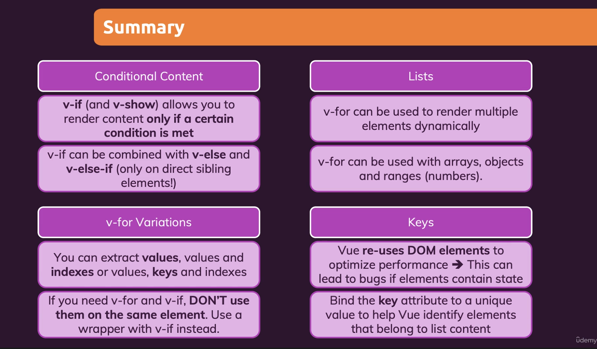

# Vue development tools (Part 5)

### `Key Word: Conditional rendering & render a list.`

- #### Click here: [BACK TO NAVIGASTION](https://github.com/DonghaoWu/WebDev-tools-demo/blob/master/README.md)

## `Section: Front-end`(Vue Basics)

### `Summary`: In this documentation, we learn Vue.js with condition rendering & render a list.

### `Check Dependencies & Tools:`

- null

#### `本章背景：`

- 本章主要介绍如何使用 Vue v-if / v-else-if / v-else / v-for / key.

- **要点**

  - v-if 是要跟 v-else 一起紧挨着使用的
  - v-for 最好要使用 v-bind:key
  - v-for 用在 li tag 上

  - 概括：

  <p align="center">
  
  </p>

### <span id="1.0">`Brief Contents & codes position`</span>

- #### Click here: [BACK TO NAVIGASTION](https://github.com/DonghaoWu/WebDev-tools-demo/blob/master/README.md)

- [1.1 Condition rendering.](#1.1)
- [1.2 List rendering.](#1.2)

---

### <span id="1.1">`Step1: Condition rendering.`</span>

- #### Click here: [BACK TO CONTENT](#1.0)

  1. v-if / v-else

  ```diff
  +    <p v-if="goals.length === 0">
  +      No goals have been added yet - please start adding some!
  +    </p>
  +    <ul v-else>
  +      <li
  +        v-for="(goal, index) in goals"
  +        :key="goal"
  +        v-on:click="removeGoal(index)"
  +      >
  +        {{goal}} - {{index}}
  +        <input type="text" v-on:click.stop />
  +      </li>
  +    </ul>
  ```

  2. 代码

  - **`Location: ./index.html`**

  ```html
  <!DOCTYPE html>
  <html lang="en">
    <head>
      <meta charset="UTF-8" />
      <meta name="viewport" content="width=device-width, initial-scale=1.0" />
      <title>Vue Basics</title>
      <link
        href="https://fonts.googleapis.com/css2?family=Jost:wght@400;700&display=swap"
        rel="stylesheet"
      />
      <link rel="stylesheet" href="styles.css" />
      <script src="https://unpkg.com/vue@next" defer></script>
      <script src="app.js" defer></script>
    </head>
    <body>
      <header>
        <h1>Vue Course Goals</h1>
      </header>
      <section id="user-goals">
        <h2>My course goals</h2>
        <input type="text" v-model="enteredGoal" v-on:keyup.enter="addGoal" />
        <button v-on:click="addGoal">Add Goal</button>
        <p v-if="goals.length === 0">
          No goals have been added yet - please start adding some!
        </p>
        <ul v-else>
          <li
            v-for="(goal, index) in goals"
            :key="goal"
            v-on:click="removeGoal(index)"
          >
            {{goal}} - {{index}}
            <input type="text" v-on:click.stop />
          </li>
        </ul>
      </section>
    </body>
  </html>
  ```

  - **`Location: ./app.js`**

  ```js
  const app = Vue.createApp({
    data() {
      return {
        enteredGoal: '',
        goals: [],
      };
    },
    methods: {
      addGoal() {
        this.goals.push(this.enteredGoal);
        this.enteredGoal = '';
      },
      removeGoal(index) {
        this.goals.splice(index, 1);
      },
    },
  });
  app.mount('#user-goals');
  ```

#### `Comment:`

1. v-if 意味着删除整个 dom node，v-show 是设置 visibility 为 0，所以如果只需要在加载时就能一次判断一个固定的显示/隐藏状态的话，就使用 v-if。

### <span id="1.2">`Step2: List rendering.`</span>

- #### Click here: [BACK TO CONTENT](#1.0)

  1. v-for array

  ```diff
  +    <ul v-else>
  +      <li
  +        v-for="(goal, index) in goals"
  +        :key="goal"
  +        v-on:click="removeGoal(index)"
  +      >
  +        {{goal}} - {{index}}
  +        <input type="text" v-on:click.stop />
  +      </li>
  +    </ul>
  ```

  2. v-for object

  ```diff
  +    <ul>
  +      <li v-for="(value, key, index) in {name:'Heo', age:'10'}">
  +        {{index}} - {{key}}: {{value}}
  +      </li>
  +    </ul>
  ```

  3. v-for number

  ```diff
  +    <ul>
  +      <li v-for="num in 3">{{num}}</li>
  +    </ul>
  ```

  4. 代码

  - **`Location: ./index.html`**

  ```html
  <!DOCTYPE html>
  <html lang="en">
    <head>
      <meta charset="UTF-8" />
      <meta name="viewport" content="width=device-width, initial-scale=1.0" />
      <title>Vue Basics</title>
      <link
        href="https://fonts.googleapis.com/css2?family=Jost:wght@400;700&display=swap"
        rel="stylesheet"
      />
      <link rel="stylesheet" href="styles.css" />
      <script src="https://unpkg.com/vue@next" defer></script>
      <script src="app.js" defer></script>
    </head>
    <body>
      <header>
        <h1>Vue Course Goals</h1>
      </header>
      <section id="user-goals">
        <h2>My course goals</h2>
        <input type="text" v-model="enteredGoal" v-on:keyup.enter="addGoal" />
        <button v-on:click="addGoal">Add Goal</button>
        <p v-if="goals.length === 0">
          No goals have been added yet - please start adding some!
        </p>
        <ul v-else>
          <li
            v-for="(goal, index) in goals"
            :key="goal"
            v-on:click="removeGoal(index)"
          >
            {{goal}} - {{index}}
            <input type="text" v-on:click.stop />
          </li>
        </ul>
        <ul>
          <li v-for="(value, key, index) in {name:'Heo', age:'10'}">
            {{index}} - {{key}}: {{value}}
          </li>
        </ul>
        <ul>
          <li v-for="num in 3">{{num}}</li>
        </ul>
        <p>{{goals}}</p>
      </section>
    </body>
  </html>
  ```

  - **`Location: ./app.js`**

  ```js
  const app = Vue.createApp({
    data() {
      return {
        enteredGoal: '',
        goals: [],
      };
    },
    methods: {
      addGoal() {
        this.goals.push(this.enteredGoal);
        this.enteredGoal = '';
      },
      removeGoal(index) {
        this.goals.splice(index, 1);
      },
    },
  });
  app.mount('#user-goals');
  ```

#### `Comment:`

1. v-for 是使用在 li tag 中的，跟 react 的处理有点不一样
2. 使用 v-bind:key 最好不要使用 index，为什么？
3. 可以使用 computed 代替 html 的行内 js 逻辑。

- #### Click here: [BACK TO CONTENT](#1.0)
- #### Click here: [BACK TO NAVIGASTION](https://github.com/DonghaoWu/WebDev-tools-demo/blob/master/README.md)

```

```
