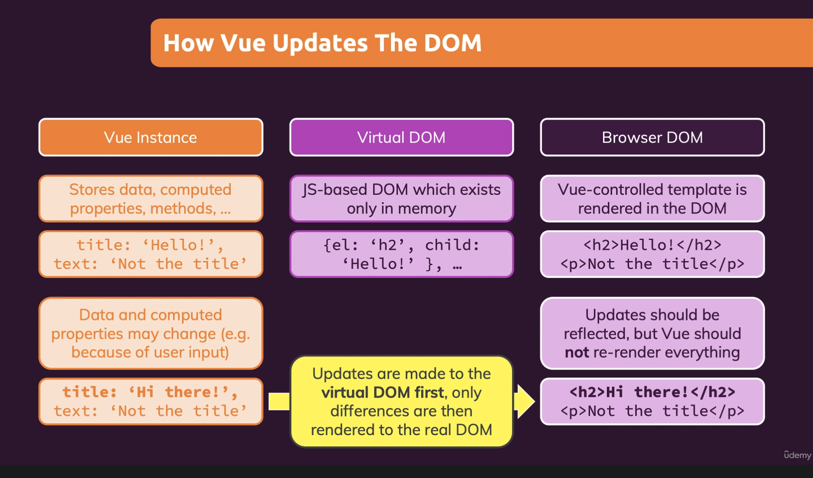

# Vue development tools (Part 6)

### `Key Word: 阶段总结.`

- #### Click here: [BACK TO NAVIGASTION](https://github.com/DonghaoWu/WebDev-tools-demo/blob/master/README.md)

## `Section: Front-end`(Vue Basics)

### `Summary`: In this documentation, we conclude all the Vue basics so far.

### `Check Dependencies & Tools:`

- null

#### `本章背景：`

- 本章主要是一个阶段总结

- **要点**

  - data
  - methods
  - computed
  - watch
  <br/>

  - v-bind
  - v-on
  - v-model
  - v-for
  - v-if / v-else-if / v-else
  <br/>

  - dynamic styling
  <br/>

  - life cycle
  - virtual dom
  - refs

  <br/>

  - virtual-dom：
  <br/>

  <p align="center">
  
  </p>

### <span id="1.0">`Brief Contents & codes position`</span>

- #### Click here: [BACK TO NAVIGASTION](https://github.com/DonghaoWu/WebDev-tools-demo/blob/master/README.md)

- [1.1 Data binding.](#1.1)
- [1.2 Methods.](#1.2)
- [1.3 Computed.](#1.3)
- [1.4 watch.](#1.4)
- [1.5 v-model / v-for / v-if / v-else-if / v-else](#1.5)
- [1.6 Dynamic styling.](#1.6)
- [1.7 Life-cycle.](#1.7)

---

### <span id="1.1">`Step1: Data binding.`</span>

- #### Click here: [BACK TO CONTENT](#1.0)

  1. example

  ```diff
  + <p>{{finalGoal}}</p>

  + <p v-html="htmlGoal"></p>

  + <a v-bind:href="vueLink">About Vue</a>

  + <div :class="{demo: true, active: boxCSelected}"></div>
  ```

#### `Comment:`

1. 需要注意的是，{{}} 和 "" 里面都是使用 JS 规则，但是由于 Vue 的一些便利，使得可以直接引用 data 里面的变量名称。

---

### <span id="1.2">`Step2: Methods.`</span>

- #### Click here: [BACK TO CONTENT](#1.0)

  1. example

  ```diff
  + <p>{{outputGoalUsingStaticData()}}</p>

  + <button v-on:click="add">Add 1 - static</button>

  + <button v-on:click="addWithParam(num)">Add {{num}}</button>

  + <input type="text" v-on:input="setFullname($event, lastName)" />

  + <input type="text" v-on:input="setFullname($event, lastName)" v-on:keyup.enter='confirmInput'/>

    methods: {
      add() {
        this.counter = this.counter + 2;
      },
      addWithParam(num) {
        this.counter = this.counter + num;
      },
      setName(e) {
        this.name = e.target.value;
      },
      setFullname(e, lastname) {
        this.fullname = e.target.value + ' ' + lastname;
      },
    },
  ```

#### `Comment:`

1. method 使用在 event 中时 () 可有可无，但是在 {{}} 中时必须添加 ().
2. method 可以替代 computed，method 最好使用在 event 中，method 的参数可带可不带。

### <span id="1.3">`Step3: Computed.`</span>

- #### Click here: [BACK TO CONTENT](#1.0)

  1. example

  ```diff
  + <p>Your fullname {{ fullname }}</p>

    computed: {
      fullname() {
        return this.name + ' ' + this.lastName;
      },
    },
  ```

#### `Comment:`

1. computed 可以用于替代 inline js code，也可以替代无参数的 method，替代 method 的时候可以提升效率

2. computed 在使用的时候不需要添加 `()`，且目前看到的 computed 函数大多数不带参数。

3. computed 一般不绑定 event

### <span id="1.4">`Step4: watch.`</span>

- #### Click here: [BACK TO CONTENT](#1.0)

  1. example

  ```diff
  + <p>watch output: {{ fullname }}</p>

    data() {
      return {
        name: '',
        lastName: '',
        fullname: '',
      };
    },
    watch: {
      name(value) {
        this.fullname = value + ' ' + this.lastName;
      },
      lastName(value) {
        this.fullname = this.name + ' ' + value;
      },
    }
  ```

#### `Comment:`

1. watch 的 function 名字必须跟 data 里面的 property 一样，且只能监测一个变量。但 computed 可以检测多个变量。

2. 关于 watch 跟 computed 的比较本章暂时只涉及一个变量和多个变量的区别，其他的区别在其他章节讨论。

3. watch 可以替代 computed。

---

### <span id="1.5">`Step5: v-model / v-for / v-if / v-else-if / v-else.`</span>

- #### Click here: [BACK TO CONTENT](#1.0)

  1. example

  ```diff
  - <input type="text" v-bind:value="name" v-on:input="setname" />
  + <input type="text" v-model=“name” />

  +    <p v-if="goals.length === 0">
  +      No goals have been added yet - please start adding some!
  +    </p>
  +    <ul v-else>
  +      <li
  +        v-for="(goal, index) in goals"
  +        :key="goal"
  +        v-on:click="removeGoal(index)"
  +      >
  +        {{goal}} - {{index}}
  +        <input type="text" v-on:click.stop />
  +      </li>
  +    </ul>
  ```

#### `Comment:`

1. v-for 中 key 前面需要添加 `:`
2. v-if / v-else-if / v-else 必须是紧挨着一起的 div
3. v-if 和 v-show 是有区别的
4. 任何情况下都不要用 index 作为 key，除非前端写死的 list，且无操作不会引起 key 变化。

### <span id="1.6">`Step6: Dynamic styling.`</span>

- #### Click here: [BACK TO CONTENT](#1.0)

  1. example

  ```diff
  + 直接 inline styling,
  + :style="<JS object>"
  - :style="{
  -   borderColor: boxASelected ? 'red' : '#ccc',
  -   backgroundColor: boxASelected ? 'salmon' : '#FFF'
  - }"

  + 使用 v-bind + JS code,
  + :class="JS code"
  - :class="boxBSelected ? 'demo active' : 'demo'"

  + 使用 `固定 + 动态` 方式，
  + class="className" :class="Js boolean object"
  - class="demo" :class="{active: boxDSelected}"

  + 使用 object + className + boolean,
  + :class="JS boolean object"
  - :class="{demo: true, active: boxCSelected}"

  + 使用 array + boolean object
  + :class=['className', <JS boolean object>]
  - :class="['demo', {active: boxFSelected}]"

  + 使用 computed
  + :class="computedFunctionName"

  - :class="boxEClasses"
  - boxEClasses() {
  -   return { active: this.boxESelected };
  - }
  ```

#### `Comment:`

1. 待添加

---

### <span id="1.7">`Step7: Life-cycle.`</span>

- #### Click here: [BACK TO CONTENT](#1.0)

  1. example

  ```diff
  + beforeCreate()
  + created()
  + beforeMount()
  + mounted()
  + beforeUpdate()
  + updated()
  + beoreUnmounted()
  + unmounted()
  ```

#### `Comment:`

1. 在 chrome 的 inspect 的 sources tag 中加入 breakpoint，就可以观察多个 breakpoint 之间的执行先后顺序，这个是一直想要学的调试工具。

- #### Click here: [BACK TO CONTENT](#1.0)
- #### Click here: [BACK TO NAVIGASTION](https://github.com/DonghaoWu/WebDev-tools-demo/blob/master/README.md)
